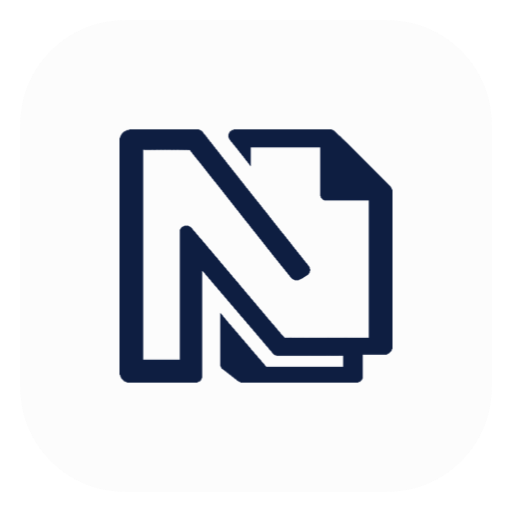
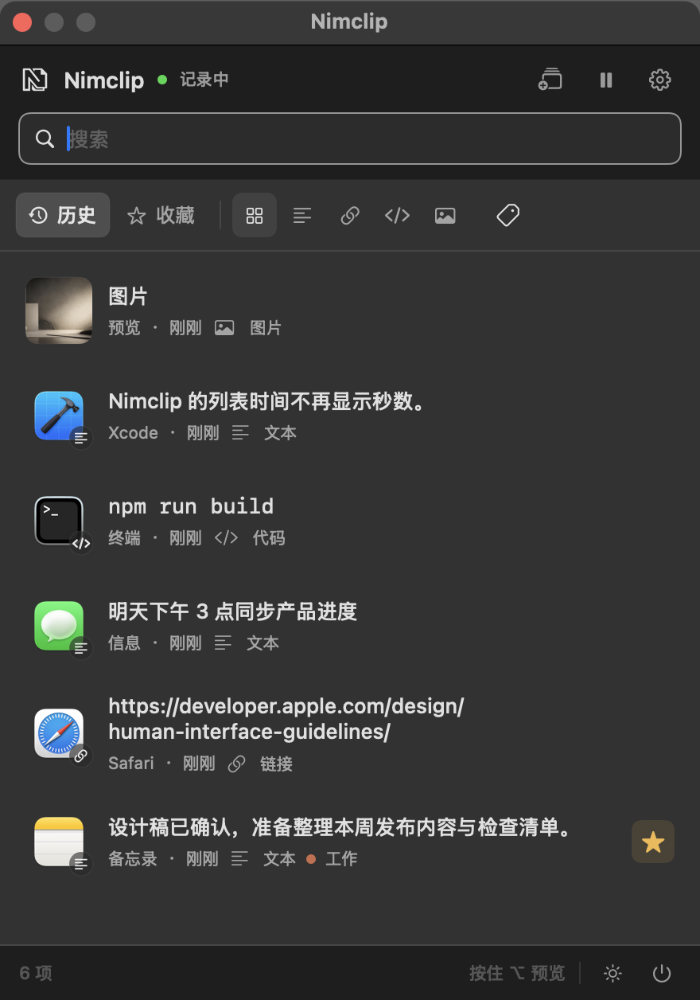
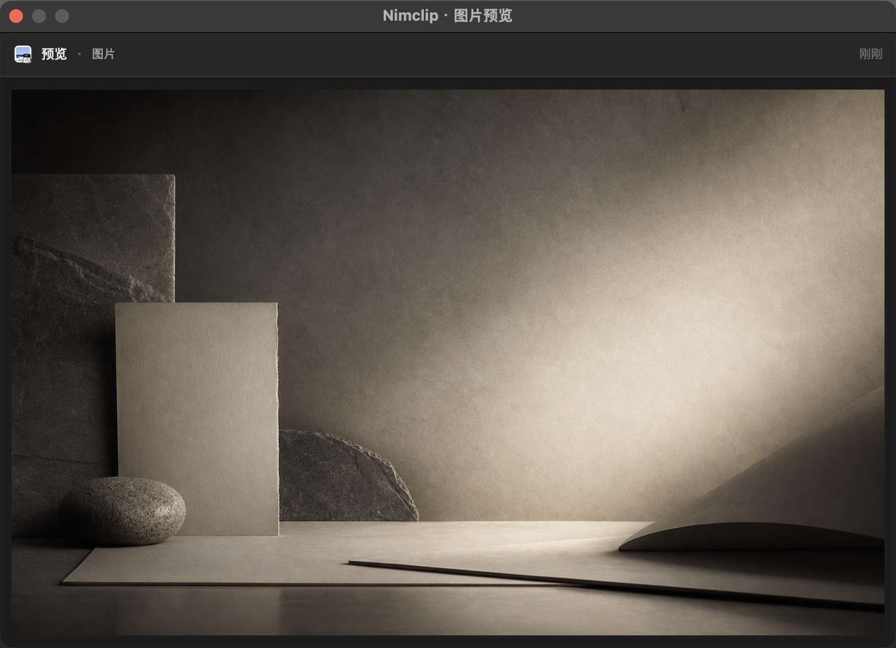
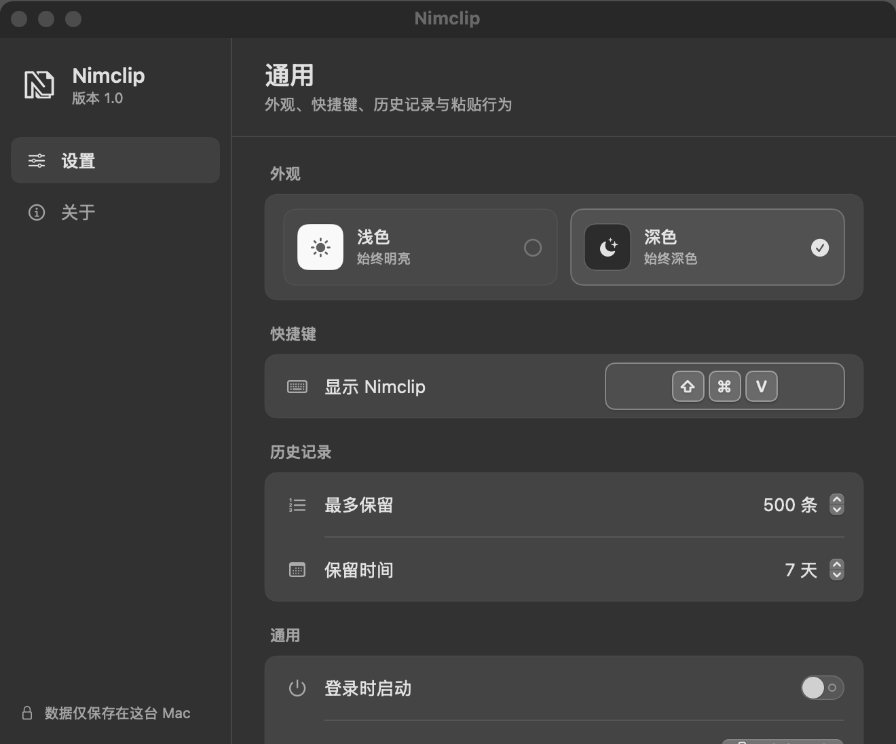

<div align="center">
  
  <h1>Nimclip</h1>
  <p><strong>复制过的东西，不该一闪而过。</strong></p>
  <p>轻量、原生、开源的 macOS 剪贴板历史工具。</p>
  <p>
    
    
    
    
  </p>
</div>

<p align="center">
  
</p>

<p align="center"><sub>真实 Nimclip 窗口截图 · 仅使用隔离的安全演示数据 · 未截取其他应用</sub></p>

Nimclip 安静地常驻在菜单栏。按下 <kbd>⌘</kbd> <kbd>⇧</kbd> <kbd>V</kbd>，刚刚复制过的文字、链接、代码和图片会立即回到眼前；搜索、选择，然后继续手头的工作。

它不仅保存“看得见的文字”，还会尽可能保留一次复制事务中的 HTML、RTF/RTFD、图片和应用自定义剪贴板表示。重新粘贴时按原 item 顺序写回，文字相同但格式不同的内容不会被误判为重复记录。

## 主要功能

| 找得快 | 粘得准 | 管得住 |
| --- | --- | --- |
| 全局快捷键随时唤起，支持即时搜索 | 保留原始格式，也可以一键转为纯文本 | 收藏重要内容，创建标签分类 |
| 按文字、链接、代码、图片快速筛选 | 多条内容按所选顺序合并复制或粘贴 | 默认保留 500 条、7 天，均可调整 |
| 显示来源应用名称与图标 | 完全相同的内容与格式自动去重 | 浅色与深色独立控制，不跟随系统切换 |

- **原生而克制**：使用 SwiftUI 与 AppKit 构建，交互贴近 macOS，不做网页式仪表盘。
- **完整预览**：按住 `Option` 悬停记录即可展开完整内容；长文本可以滚动，鼠标可以进入预览窗口继续操作。
- **纯文本粘贴**：随时清除富文本格式，不必再绕到文本编辑器中转。
- **多条拼贴**：选择多段内容，按需要的顺序一次合并，适合整理提示词、回复和重复表单。
- **来源可见**：记录来自哪个应用一目了然，找内容时不再只靠模糊记忆。
- **收藏保护**：收藏项不参与普通的时间与条数清理，不会被自动淘汰。

## 图片也能完整找回

图片记录会在列表中显示真实缩略图。打开预览后，可以在独立窗口中查看完整图片；文字记录同样支持按住 `Option` 展开，长内容可以滚动，鼠标也可以进入预览窗口继续操作。



## 浅色和深色，由你决定

Nimclip 的外观独立于系统设置。你可以在设置页中选择始终浅色或始终深色，也可以直接在主窗口底部快速切换；选择会持久保存，下次打开仍保持不变。



## 数据与隐私

Nimclip 的历史记录不是只放在内存里。应用使用 **SwiftData 持久化，底层为本机 SQLite**；退出并重新打开后，记录仍然存在。

| 数据 | 保存位置 |
| --- | --- |
| 历史、标签与设置 | `~/Library/Application Support/Cliplet.store` |
| SQLite 辅助文件 | 同目录下的 `Cliplet.store-wal` 与 `Cliplet.store-shm` |
| 剪贴板图片 | `~/Library/Application Support/Cliplet/ClipboardImages/` |

- 所有剪贴板内容只保存在这台 Mac，不要求登录账户，也不会上传到远程服务。
- 默认最多保留 `500` 条普通记录，保留时间为 `7` 天；收藏项不受这两个限制。
- 图片与格式化内容设有轻量存储上限。无法完整读取的事务会被跳过，避免留下看似正常、实际已经丢失格式的副本。

## 开始使用

### 环境要求

- macOS 15.0 或更高版本
- Xcode 16 或兼容 Swift 6 的完整 Xcode 环境
- 当前打包脚本输出 Apple Silicon（arm64）版本

### 在 Xcode 中运行

```bash
git clone https://github.com/hukdoesn/Nimclip.git
cd Nimclip
open Cliplet.xcodeproj
```

在 Xcode 中选择内部保留的 `Cliplet` scheme 后运行。项目内部名称仍为 Cliplet，安装后的应用名称为 **Nimclip**。

执行完整测试：

```bash
xcodebuild test \
  -project Cliplet.xcodeproj \
  -scheme Cliplet \
  -destination 'platform=macOS'
```

### 打包应用

```bash
./package.sh
```

脚本会重新生成菜单栏图标与 AppIcon，构建 arm64 Release、添加本机 ad-hoc 签名，并输出：

```text
dist/Nimclip.app
dist/Nimclip-macOS-arm64.zip
```

## 权限说明

Nimclip 读取系统剪贴板不需要账户或网络权限。只有“直接粘贴到当前应用”需要 macOS 辅助功能权限；未授权时，Nimclip 仍会把选中内容写回系统剪贴板，你可以手动按 <kbd>⌘</kbd> <kbd>V</kbd> 完成粘贴。

## 开源许可

Nimclip 基于 [Apache License 2.0](./LICENSE) 开源，项目归属信息见 [NOTICE](./NOTICE)。欢迎学习、修改和二次开发；重新分发原项目或衍生作品时，请按许可证要求保留适用的版权、许可与 Nimclip 原项目归属说明，并标明已修改的文件。

项目主页：<https://github.com/hukdoesn/Nimclip>

<div align="center">
  <sub>© 2026 hukdoesn ｜ 胡图图不涂涂</sub>
</div>
