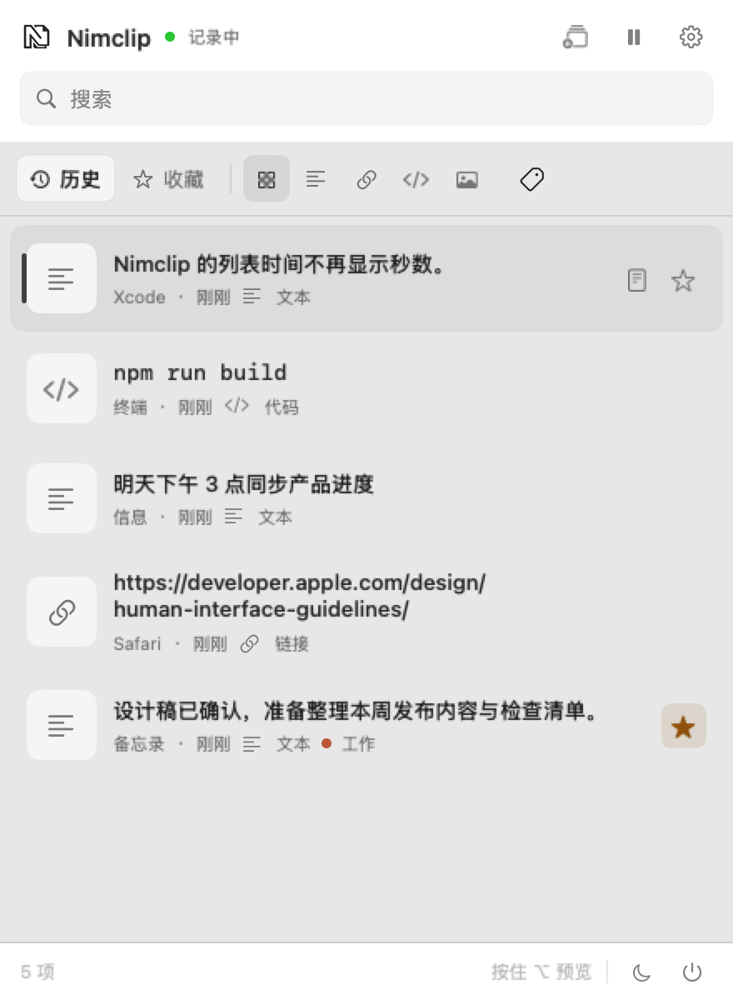
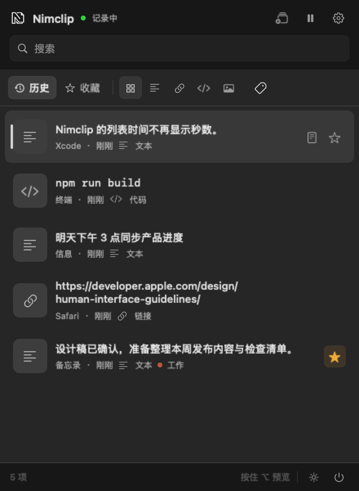
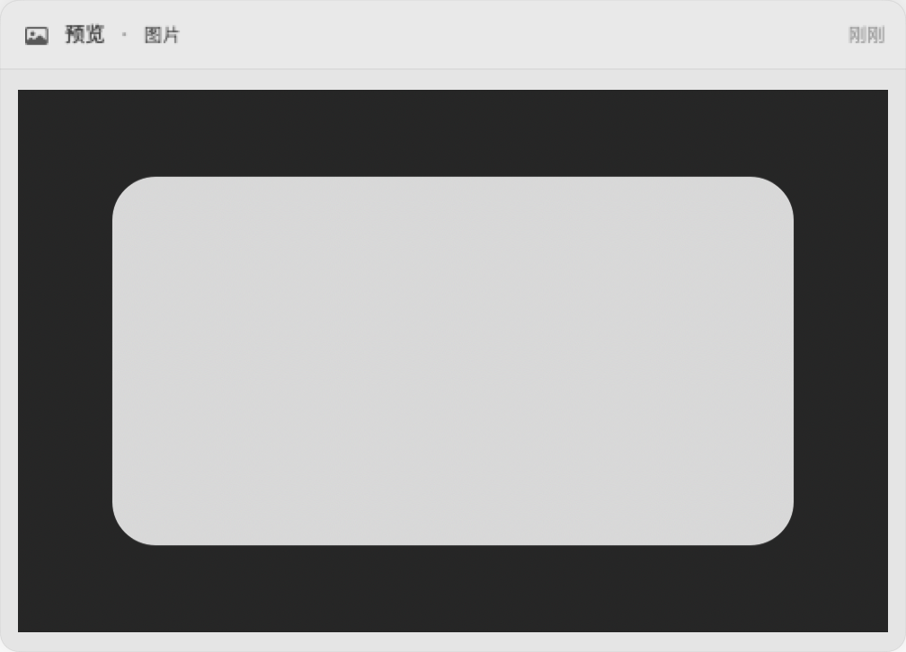
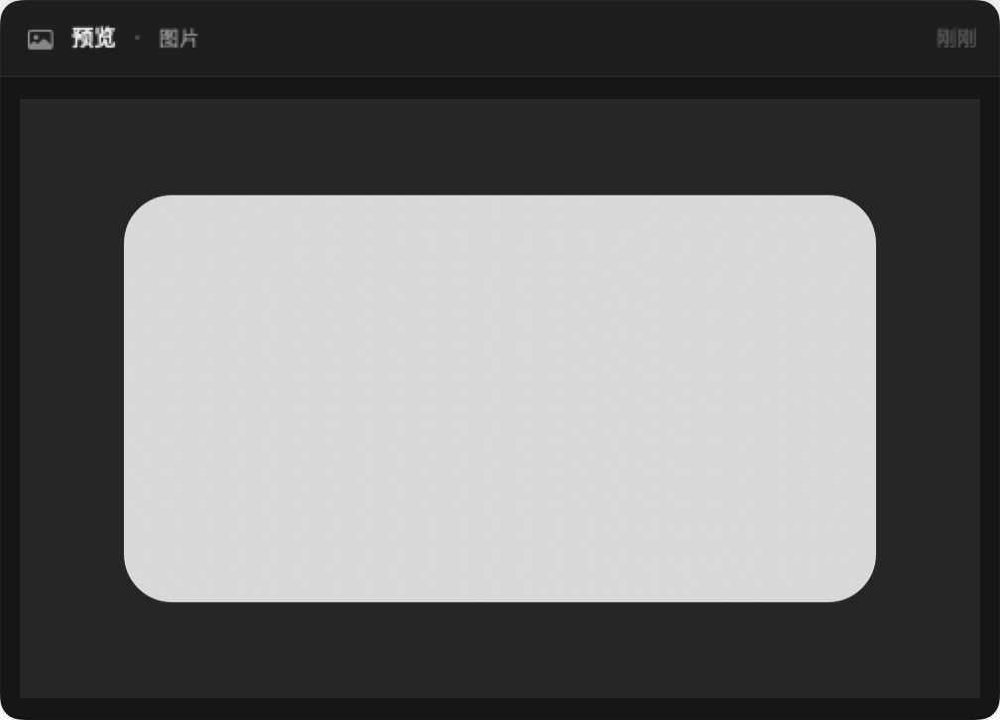
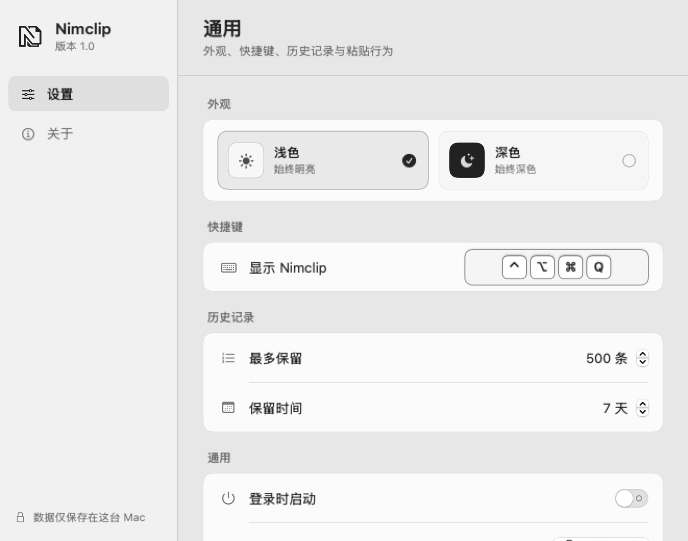
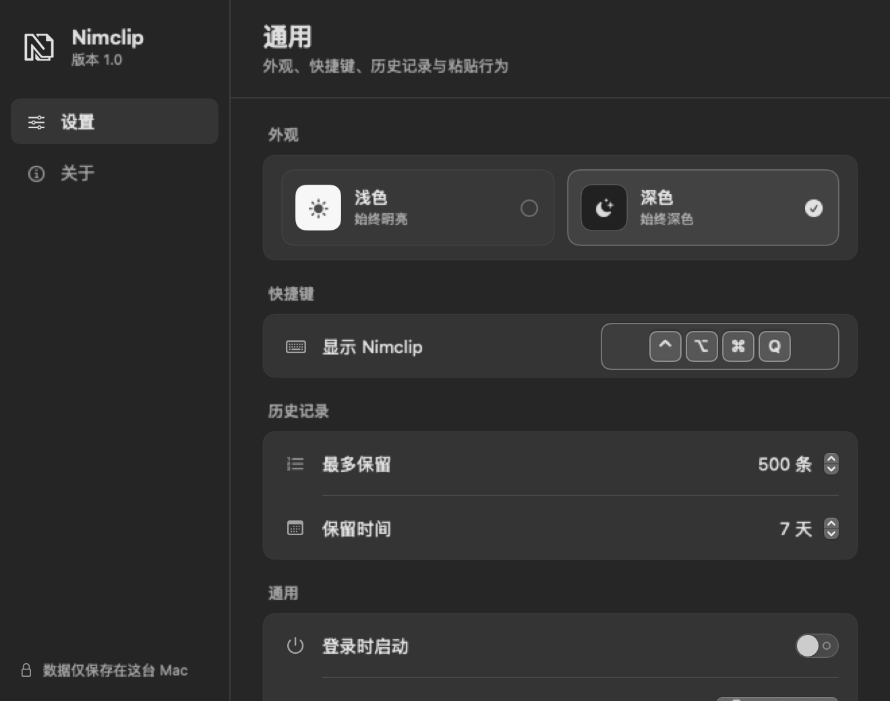
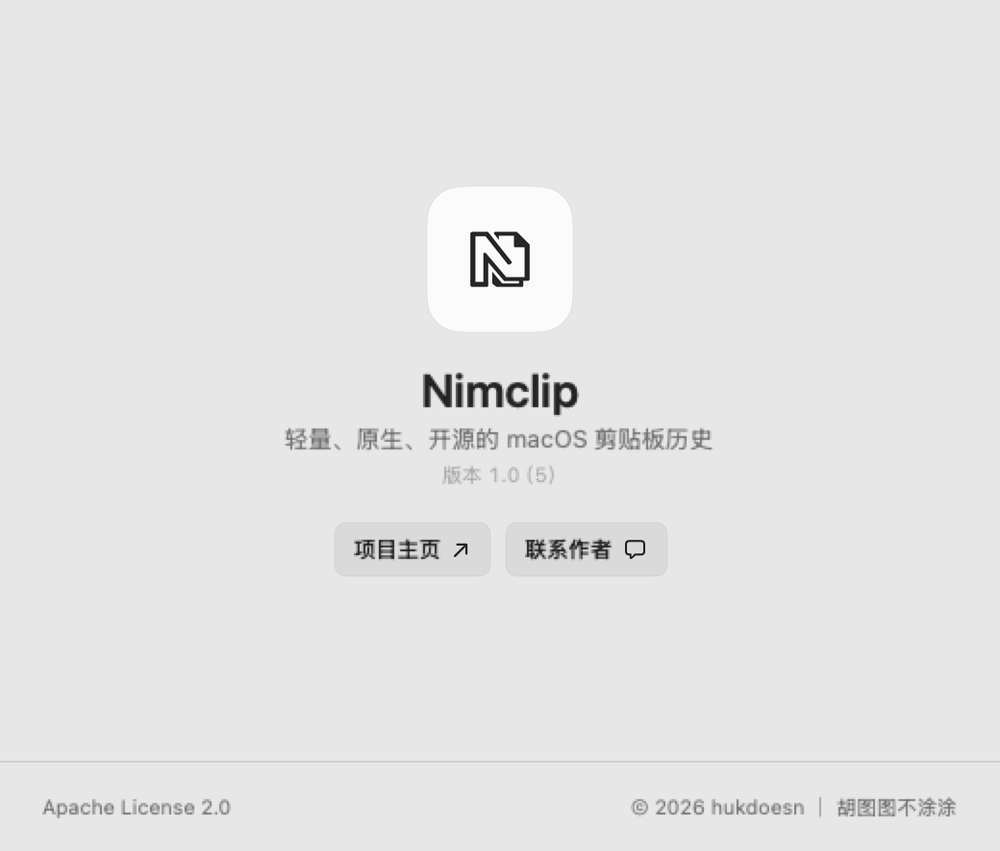
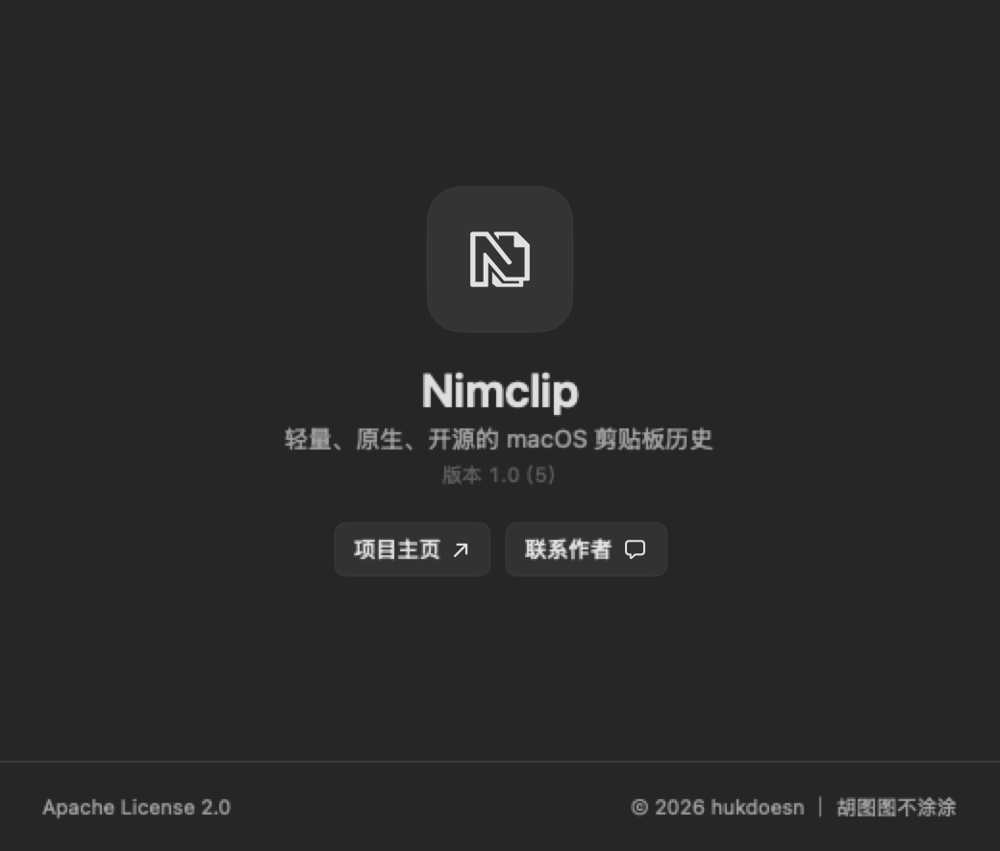

<div align="center">
  
  <h1>Nimclip</h1>
  <p>macOS 剪贴板历史工具</p>
  <p><strong>简体中文</strong> · <a href="./README_EN.md">English</a></p>
  <p>
    
    
    
  </p>
</div>

<p align="center">
  <a href="./docs/images/nimclip-menu-light@2x.png"></a>
  <a href="./docs/images/nimclip-menu-dark@2x.png"></a>
</p>
<p align="center">
  <sub>浅色与深色主题 · 点击图片查看 @2x 原图</sub>
</p>

## Nimclip 是什么

Nimclip 是一款常驻菜单栏的 macOS 剪贴板历史工具。按下 <kbd>⌘</kbd> <kbd>⇧</kbd> <kbd>V</kbd> 即可查找和粘贴之前复制过的内容。

## 相比系统剪贴板

macOS 系统剪贴板只保留当前一次复制的内容，再次复制后上一条就会被覆盖。Nimclip 提供：

- 文字、链接、代码和图片历史
- 搜索、类型筛选、收藏和标签
- 来源应用名称与图标
- 富文本和图片内容保留
- 纯文本粘贴和多条内容合并
- 可调整的保留数量和保留时间
- 独立的浅色、深色外观
- 可在应用内即时切换简体中文和英文

## 界面

### 图片预览

图片会在历史记录中显示缩略图，并可以打开完整预览。长文本同样支持独立预览和滚动查看。

<p align="center">
  <a href="./docs/images/nimclip-image-preview-light@2x.png"></a>
  <a href="./docs/images/nimclip-image-preview-dark@2x.png"></a>
</p>

### 设置

可以设置应用语言、界面外观、全局快捷键、历史上限、保留时间和登录时启动。

<p align="center">
  <a href="./docs/images/nimclip-settings-light@2x.png"></a>
  <a href="./docs/images/nimclip-settings-dark@2x.png"></a>
</p>

### 关于

关于页包含版本、开源许可、项目主页、联系作者和赞赏支持入口。“项目主页”会使用 macOS 默认浏览器打开 GitHub；“赞赏支持”会显示微信支付与支付宝收款码。

<p align="center">
  <a href="./docs/images/nimclip-about-light@2x.png"></a>
  <a href="./docs/images/nimclip-about-dark@2x.png"></a>
</p>

### 更新提醒

发现新版本时，Nimclip 会提醒前往下载。升级不会清除保存在这台 Mac 上的历史记录。

<p align="center">
  <a href="./docs/images/nimclip-update-notification.png"></a>
</p>

## 数据与隐私

Nimclip 使用 SwiftData 在本机持久化历史记录，底层为 SQLite。退出应用或重启 Mac 后，记录不会丢失。

- 所有剪贴板内容只保存在当前 Mac
- 不需要账户，不会上传剪贴板内容
- 默认保留 `500` 条、`7` 天，收藏内容不会被自动清理
- 历史和设置：`~/Library/Application Support/Cliplet.store`
- 图片：`~/Library/Application Support/Cliplet/ClipboardImages/`

## 赞赏支持

Nimclip 是免费开源项目，所有功能都可以免费使用。如果它对你有帮助，也可以自愿请作者喝杯咖啡。

<table align="center">
  <tr>
    <th>微信支付</th>
    <th>支付宝</th>
  </tr>
  <tr>
    <td align="center"></td>
    <td align="center"></td>
  </tr>
  <tr>
    <td align="center" colspan="2">收款人：胡图图不涂涂</td>
  </tr>
</table>

## 安装

安装包：

- Apple Silicon（M1、M2、M3、M4 等）：`Nimclip-macOS-arm64.zip`
- Intel：`Nimclip-macOS-x86_64.zip`

1. 从 [GitHub Releases](https://github.com/hukdoesn/Nimclip/releases) 下载与 Mac 芯片对应的安装包。
2. 解压后将 `Nimclip.app` 移入“应用程序”文件夹。
3. 打开 Nimclip，使用 <kbd>⌘</kbd> <kbd>⇧</kbd> <kbd>V</kbd> 唤起剪贴板历史。

支持 macOS 15.0 及更高版本。“直接粘贴”需要 macOS 辅助功能权限；未授权时仍可以复制选中内容后手动粘贴。

### 首次打开

如果系统阻止打开 Nimclip：

1. 双击一次 `Nimclip.app`，然后关闭系统提示。
2. 打开“系统设置”→“隐私与安全性”。
3. 在“安全性”区域找到 Nimclip，点击“仍要打开”（Open Anyway）。
4. 输入 Mac 登录密码，再次确认打开。

**如果仍提示无法打开**

确认安装包来自 Nimclip 项目主页后，打开“终端”执行：

```bash
xattr -dr com.apple.quarantine "/Applications/Nimclip.app"
open "/Applications/Nimclip.app"
```

## 开源许可

Nimclip 基于 [Apache License 2.0](./LICENSE) 开源。修改或重新分发时，请保留 `LICENSE`、`NOTICE` 和 Nimclip 原项目归属说明，并标明已修改的内容。

项目主页：<https://github.com/hukdoesn/Nimclip>

<div align="center">
  <sub>© 2026 hukdoesn ｜ 胡图图不涂涂</sub>
</div>
