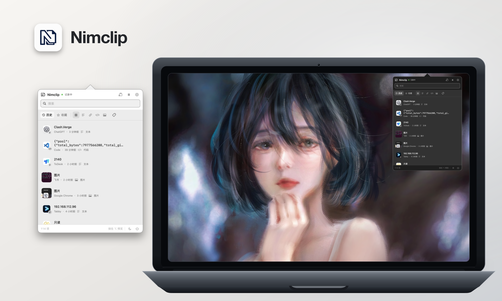
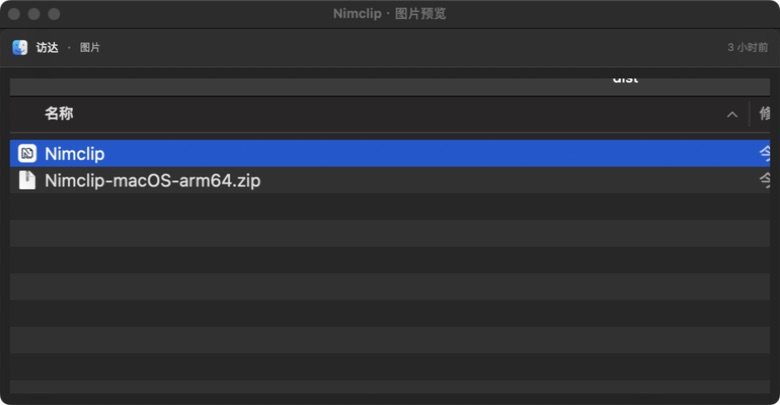
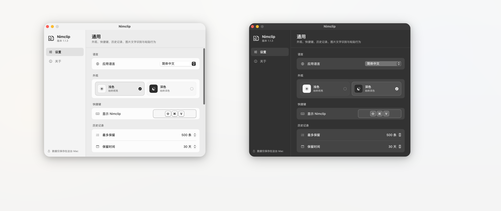
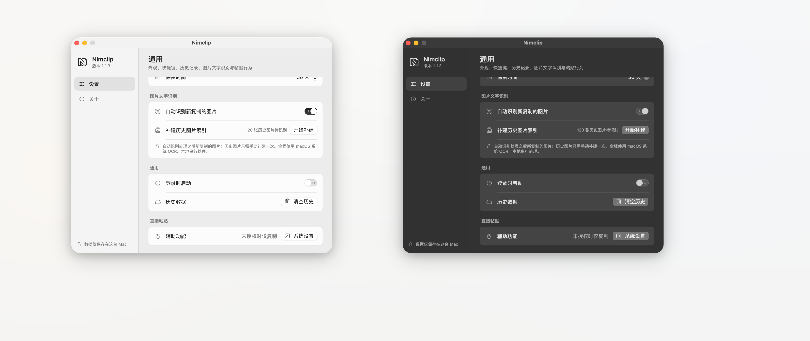
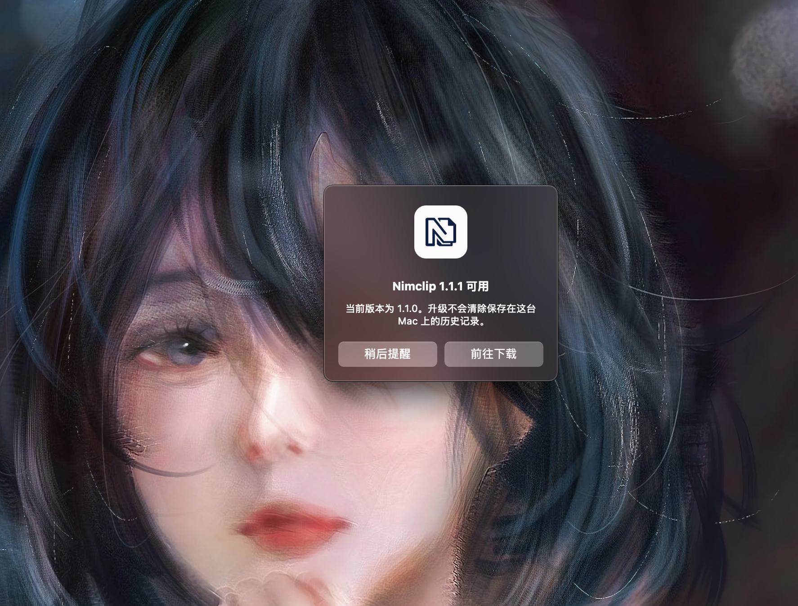

<div align="center">
  
  <h1>Nimclip</h1>
  <p>Clipboard history manager for macOS</p>
  <p><a href="./README.md">简体中文</a> · <strong>English</strong></p>
  <p>
    
    
    
    
  </p>
</div>

<p align="center">
  
</p>

## What is Nimclip?

Nimclip is a free, open-source, native, local-first clipboard history manager for macOS. It is built with Swift, SwiftUI, and SwiftData and lives in the menu bar. Press <kbd>⌘</kbd> <kbd>⇧</kbd> <kbd>V</kbd> to find, organize, and paste something you copied earlier.

## Features

- History for text, links, code, images, and rich text, including source app names and icons
- Automatic classification of links and common code, with filters for all content, text, links, code, and images
- Search across text, recognized image text, source app names, and tags
- Favorites plus create, rename, delete, color-code, and filter by tags
- Preservation of rich-text formatting and images, with optional plain-text copy and paste
- Ordered multi-item text collection for a single copy or paste
- Image thumbnails, full image previews, and scrollable long-text previews
- Repeated copies refresh the existing item and move it to the top instead of creating duplicates
- Customizable global shortcut, history limit, retention period, and launch at login; the oldest non-favorites are deleted automatically at the limit, while favorites do not count toward it
- Pause and resume clipboard recording
- Independent light and dark appearances
- Instant in-app switching between Simplified Chinese and English
- Automatic GitHub Releases update checks after launch and while the app is running

## Quick start

| Action | How |
| --- | --- |
| Open history | Click the menu bar icon or press <kbd>⌘</kbd> <kbd>⇧</kbd> <kbd>V</kbd> |
| Search | Start typing after opening; the search field is focused automatically |
| Select an item | Use <kbd>↑</kbd>/<kbd>↓</kbd> to move through the results |
| Paste | Click an item, or select it and press <kbd>Return</kbd> |
| Preview | Hover over an item and hold <kbd>⌥ Option</kbd> |
| More actions | Right-click an item to copy, paste as plain text, favorite, tag, open a link, or delete |
| Delete an item | Select it and press <kbd>Delete</kbd>, or use the context menu |
| Combine items | Enter multi-item mode, select text items in order, then copy or paste |
| Close the panel | Press <kbd>Esc</kbd> or click outside the panel |

Every time the panel opens, Nimclip selects the first item in the current search and filter results and scrolls the list to the top, keeping the newest available content ready to use.

Default and customized global shortcut keys are order-independent. With the default <kbd>⌘</kbd> <kbd>⇧</kbd> <kbd>V</kbd> shortcut, Nimclip opens as soon as all three keys are held, whether V or the modifiers were pressed first. A held chord triggers only once until one of its required keys is released.

## Interface

### Image and long-text previews

Images appear as thumbnails in clipboard history and can be opened in a full preview. Long text also supports a separate, scrollable preview.

<p align="center">
  
</p>

### Image text recognition

Image text recognition is enabled by default. Once enabled, newly copied images are indexed automatically with macOS Vision OCR, allowing you to find an image by searching for text inside it. Automatic recognition does not retroactively process images saved before the feature was installed, preventing a surprise burst of CPU work after an upgrade. Those existing images need only one manual indexing pass.

- Automatically detects languages, with Simplified Chinese and English configured as primary recognition languages
- Can be disabled under Settings → Image Text Recognition
- Existing history images can be indexed once in a batch, with progress and cancellation controls
- OCR only creates a search index and does not modify the stored original image
- Recognition runs locally in a low-priority serial queue, uploads nothing, and stops using CPU when finished

### Settings

Configure the app language, appearance, global shortcut, history limit, retention period, image text recognition, launch at login, and direct-paste permission.

<p align="center">
  
</p>
<p align="center"><sub>Appearance, shortcut, and history settings</sub></p>

<p align="center">
  
</p>
<p align="center"><sub>Image text recognition, general, and direct-paste settings</sub></p>

Defaults:

| Setting | Default | Range |
| --- | --- | --- |
| Global shortcut | <kbd>⌘</kbd> <kbd>⇧</kbd> <kbd>V</kbd> | Record a different shortcut in the app |
| History limit | 500 items | 100–5000 items |
| Retention period | 7 days | 1–365 days |
| Image text recognition | Enabled | Can be disabled; existing images can be indexed manually |
| Launch at login | Disabled | Can be enabled in Settings |

The history limit applies only to non-favorite clips. When it is exceeded, Nimclip automatically removes the oldest non-favorites and their local image files. Favorites are never removed automatically, so the total item count can exceed the configured limit.

### Update notifications

Nimclip checks GitHub Releases about four seconds after launch and then every 10 minutes while running. Only a newer stable release is offered, and failed automatic checks do not interrupt your work. You can also check manually from the About page.

When an update is available, Nimclip can open its Release page. Automatic reminders for the same version are separated by at least 24 hours. Replacing the app with a newer version does not remove clipboard history stored on your Mac.

<p align="center">
  
</p>

### About

The About page includes the version, open-source license, project home, contact options, and a Support entry. Support displays the WeChat Pay and Alipay QR codes inside Nimclip.

## Privacy and storage

Nimclip persists clipboard history locally with SwiftData and SQLite. Your history remains available after quitting the app or restarting your Mac.

- Clipboard contents stay on your Mac
- No account is required
- Clipboard contents are never uploaded
- Image text recognition uses macOS Vision OCR; its working image is scaled to at most 2560 pixels on the longest side without changing the original
- The default retention policy is 500 items for 7 days
- Favorites are never removed automatically
- Clear History preserves favorites; deleting an individual item also removes its local image files
- History and settings: `~/Library/Application Support/Cliplet.store`
- Images: `~/Library/Application Support/Cliplet/ClipboardImages/`

Automatic update checks request only public release metadata from GitHub and never include clipboard contents.

## Support

Nimclip is free and open source, and every feature remains free to use. If it helps you, you can optionally buy the author a coffee.

<table align="center">
  <tr>
    <th>WeChat Pay</th>
    <th>Alipay</th>
  </tr>
  <tr>
    <td align="center"></td>
    <td align="center"></td>
  </tr>
</table>

## Installation

Download the appropriate archive from [GitHub Releases](https://github.com/hukdoesn/Nimclip/releases):

- Apple Silicon: `Nimclip-macOS-arm64.zip`
- Intel: `Nimclip-macOS-x86_64.zip`

1. Unzip the archive and move `Nimclip.app` into the Applications folder.
2. Open Nimclip.
3. Press <kbd>⌘</kbd> <kbd>⇧</kbd> <kbd>V</kbd> to open clipboard history.

Nimclip requires macOS 15.0 or later. Direct paste requires macOS Accessibility permission. Without it, Nimclip can still copy the selected item so you can paste it manually.

Both Apple Silicon and Intel archives are provided. The download badge at the top counts total asset downloads across GitHub Releases.

### First launch

If macOS prevents Nimclip from opening:

1. Double-click `Nimclip.app` once, then close the system warning.
2. Open System Settings → Privacy & Security.
3. Find Nimclip in the Security section and click **Open Anyway**.
4. Enter your Mac login password and confirm.

If it is still blocked, verify that the archive came from the Nimclip repository, then run:

```bash
xattr -dr com.apple.quarantine "/Applications/Nimclip.app"
open "/Applications/Nimclip.app"
```

### Direct-paste permission

Nimclip writes the selected history item back to the system clipboard and then pastes it into the app you were previously using. To enable direct paste:

1. Open Nimclip Settings → Direct Paste.
2. Click **System Settings**.
3. Allow Nimclip under Privacy & Security → Accessibility.

Without Accessibility permission, history, search, copy, OCR, and previews still work. A paste action copies the item instead, after which you can press <kbd>⌘</kbd> <kbd>V</kbd> manually.

## Build from source

Requirements:

- macOS 15.0 or later
- Xcode 16 or later
- Swift 6

Open `Cliplet.xcodeproj` in Xcode, or run the following commands from the repository root:

```bash
xcodebuild build \
  -project Cliplet.xcodeproj \
  -scheme Cliplet \
  -configuration Debug \
  CODE_SIGNING_ALLOWED=NO

xcodebuild test \
  -project Cliplet.xcodeproj \
  -scheme Cliplet \
  -configuration Debug \
  CODE_SIGNING_ALLOWED=NO
```

Create ad-hoc signed distributable archives:

```bash
./package.sh arm64
./package.sh x86_64
```

Artifacts are written to `dist/`, together with a SHA-256 checksum for each ZIP. A self-built app without Apple Developer ID signing and notarization may still require the first-launch Gatekeeper steps above.

## Community

- [LINUX DO — A new kind of ideal community](https://linux.do/)

## License

Nimclip is open source under the [Apache License 2.0](./LICENSE). Modified or redistributed versions must retain `LICENSE`, `NOTICE`, the original project attribution, and a notice describing the changes.

Project home: <https://github.com/hukdoesn/Nimclip>

<div align="center">
  <sub>© 2026 hukdoesn ｜ 胡图图不涂涂</sub>
</div>
